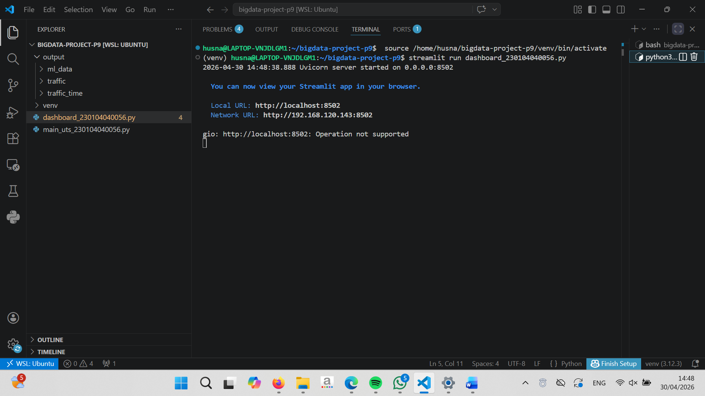
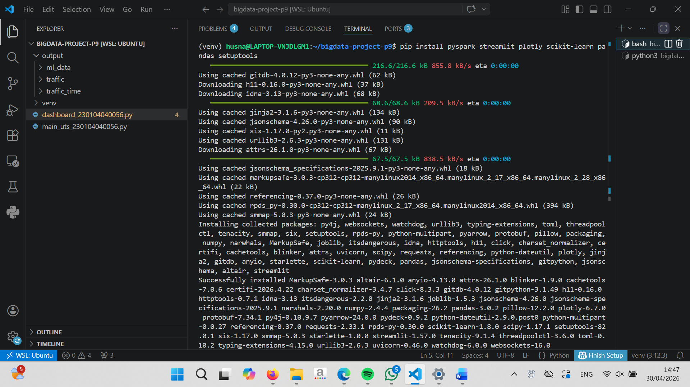
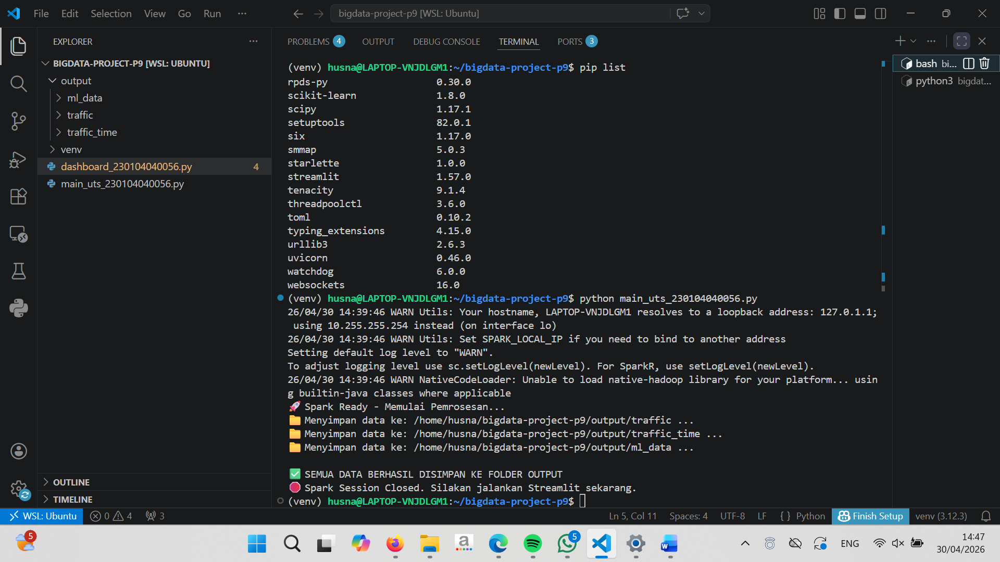
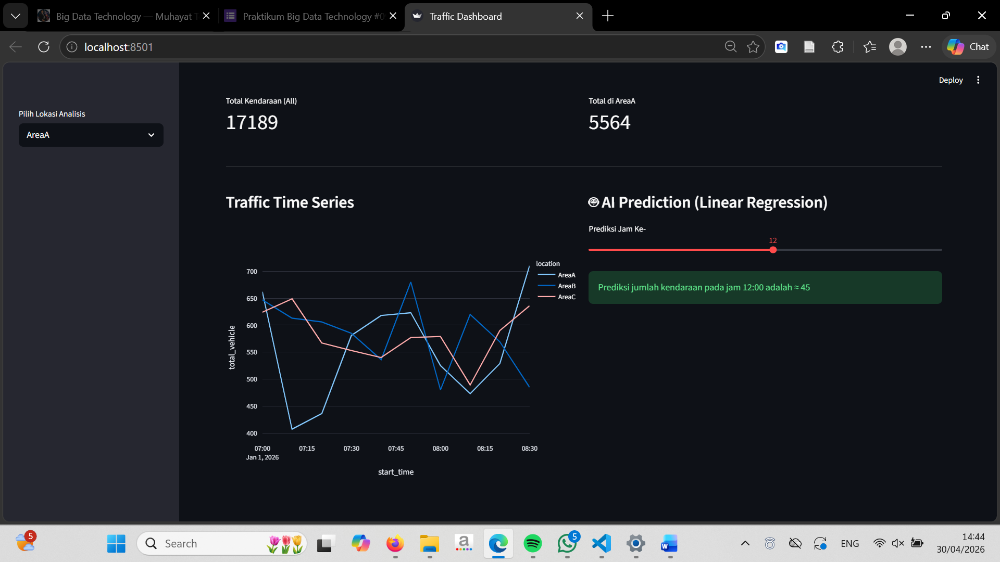
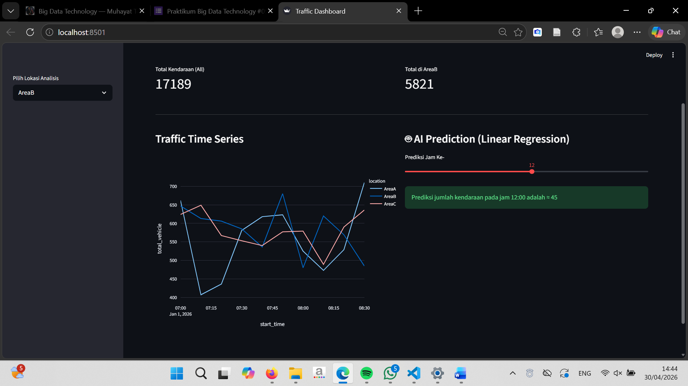

# 🚀 Praktikum 9 — Smart City AI Traffic (Big Data Pipeline)

**Sistem Monitoring dan Prediksi Kepadatan Kendaraan Berbasis Big Data Framework**

Praktikum ini membahas implementasi sistem **monitoring dan prediksi kepadatan lalu lintas** menggunakan teknologi Big Data.

Sistem dikembangkan menggunakan pipeline mulai dari **data generation (simulasi sensor), processing (Apache Spark), penyimpanan (Parquet)**, hingga **visualisasi dashboard menggunakan Streamlit dan prediksi AI (Linear Regression)**.

Pendekatan ini memungkinkan analisis lalu lintas secara cepat, efisien, dan interaktif.

**Topik:** Big Data, Apache Spark, Parquet, Streamlit, Machine Learning, Smart City

---

## 🧑‍🎓 Informasi Mahasiswa

| Informasi         | Data                                                             |
| ----------------- | ---------------------------------------------------------------- |
| Mata Kuliah       | Teknologi Big Data                                               |
| Dosen Pengampu    | Muhayat, M.IT                                                    |
| Nama Mahasiswa    | Husna Norgina                                                    |
| NIM               | 230104040056                                                     |
| Kelas             | TI23B                                                            |
| Repo GitHub       | https://github.com/husna-norgina/bigdata-technology-p9           |
| Tanggal Praktikum | 30-04-2026                                                       |

---

# 🎯 Tujuan Praktikum

1. Membangun pipeline Big Data berbasis batch processing
2. Menggunakan Apache Spark untuk pengolahan data
3. Menggunakan Parquet sebagai format penyimpanan efisien
4. Membangun dashboard interaktif menggunakan Streamlit
5. Mengimplementasikan Machine Learning sederhana (Linear Regression)
6. Mengintegrasikan sistem end-to-end dari data hingga visualisasi

---

# 🏛 Arsitektur Pipeline

**Data Generation → Spark Processing → Parquet Storage → Machine Learning → Dashboard (Streamlit)**

---

# 🛠 Tools & Environment

Tools yang digunakan:

* Ubuntu (WSL – Linux Environment)
* Visual Studio Code
* Python 3
* Apache Spark (PySpark)
* Pandas
* Scikit-learn
* Streamlit
* Plotly
* Git & GitHub

---

# 🧱 Struktur Project

```
bigdata-technology-p9/
│
├── main_uts_230104040056.py
├── dashboard_230104040056.py
│
├── output/
│   ├── traffic/
│   ├── traffic_time/
│   └── ml_data/
│
├── evidence/
│   ├── Terminal_1.png
│   ├── Terminal_2.png
│   ├── Terminal_3.png
│   ├── Dashboard_A.png
│   ├── Dashboard_B.png
│   └── Dashboard_C.png
│
└── README.md
```

---

# ⚙️ Sistem Monitoring & Prediksi

Sistem terdiri dari beberapa proses utama:

* **Data Simulation**
  Data kendaraan dibuat sebagai simulasi sensor dari beberapa lokasi (AreaA, AreaB, AreaC)

* **Data Processing (Spark)**

  * Total kendaraan per lokasi
  * Tren kendaraan per waktu
  * Data untuk Machine Learning

* **Parquet Storage**
  Data disimpan dalam format Parquet agar:

  * Lebih ringan
  * Lebih cepat dibaca

* **Machine Learning (Linear Regression)**
  Digunakan untuk memprediksi jumlah kendaraan berdasarkan jam tertentu

---

# 🚀 Cara Menjalankan

### 1. Jalankan Engine (Spark)

```bash
python main_uts_230104040056.py
```

### 2. Verifikasi Output

```bash
ls output/traffic
```

### 3. Jalankan Dashboard

```bash
streamlit run dashboard_230104040056.py
```

---

# 📊 Dashboard Smart Traffic

Dashboard dibuat menggunakan **Streamlit** dengan fitur:

* KPI Total Kendaraan
* Filter lokasi (AreaA, AreaB, AreaC)
* Grafik tren kepadatan kendaraan (Plotly)
* Prediksi jumlah kendaraan berdasarkan jam

Akses dashboard:
👉 [http://localhost:8501](http://localhost:8501)

---

# 📸 Screenshot Praktikum

---

## 1️⃣ Screenshot Penulisan Parquet (WAJIB)



Menampilkan proses penyimpanan data ke folder output dan status berhasil (**SEMUA DATA BERHASIL DISIMPAN**).

---

## 2️⃣ Screenshot Proses Terminal

### a. Install & Setup Environment



### b. Eksekusi Program Spark



---

## 3️⃣ Screenshot Dashboard

### a. Area A



### b. Area B



### c. Area C


---

# 📄 Laporan Praktikum 9

📎 [230104040056_Husna Norgina_TBG_P9.pdf](evidence/230104040056_Husna%20Norgina_TBG_P9.pdf)

---

# 💡 Insight Sistem

Sistem menunjukkan bahwa keberhasilan implementasi Big Data tidak hanya bergantung pada algoritma, tetapi juga pada efisiensi pipeline data. Penggunaan Apache Spark mempercepat pemrosesan data, sedangkan format Parquet meningkatkan efisiensi penyimpanan dan akses data. Integrasi dengan Streamlit memungkinkan visualisasi interaktif, dan penerapan Machine Learning memberikan nilai tambah dalam bentuk prediksi yang mendukung analisis lalu lintas.

---

# ✅ Kesimpulan

Praktikum 9 berhasil membangun sistem monitoring dan prediksi kepadatan kendaraan berbasis Big Data dengan mengintegrasikan Apache Spark, Parquet, dan Streamlit. Sistem ini mampu mengolah data secara efisien, menampilkan visualisasi interaktif, serta memberikan prediksi sederhana menggunakan Linear Regression. Sistem ini masih dapat dikembangkan lebih lanjut dengan model AI yang lebih kompleks untuk meningkatkan akurasi prediksi.

---

📝 *Disusun oleh Husna Norgina (230104040056) — Praktikum 9 Teknologi Big Data*

---
